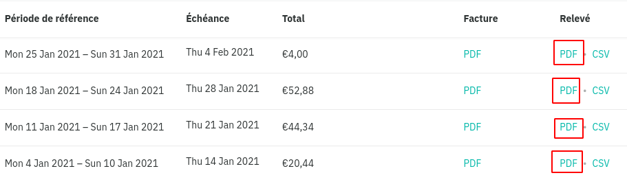
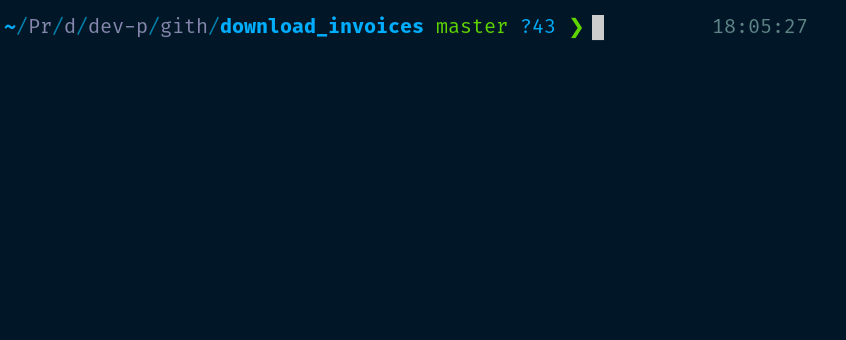
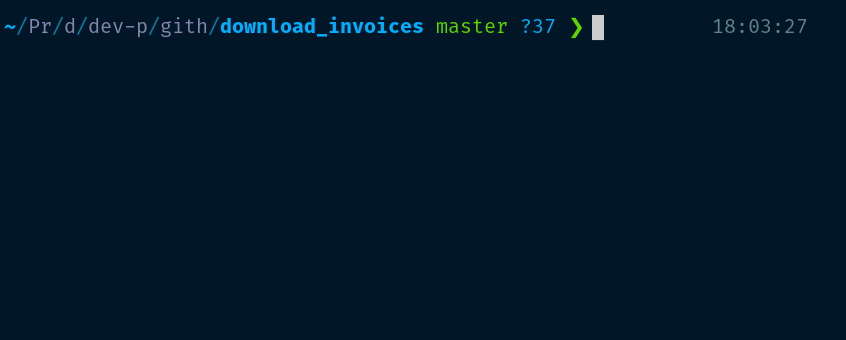
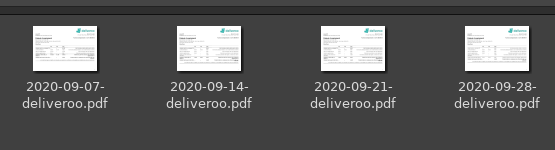

# Deliveroo invoices scraper

An automation script written in Python 3.6.9 using [requests](https://requests.readthedocs.io/) module.
It will download restaurant invoices from [Deliveroo Restaurant Hub](https://restaurant-hub.deliveroo.net/).

Deliveroo Restaurant Hub is used for Deliveroo partner restorers to manage their restaurant, track customers orders or download invoices.

**To use this scraper, you need to have a restaurant account on Deliveroo Restaurant Hub.**

## Why I created this script ?

To download all of invoices, we need to click on every single button to download weekly invoices.



It's a waste of time! So I need a script that download each invoice automatically

## Installation

Open the terminal and type:

```shell
git clone https://github.com/xingcdev/deliveroo-restaurant-hub-scraper.git
```

It will clone the project on your local folder.

## Usage

Write your information in `scraper.py`:

```python
#--- Customize here
email = 'YOUR EMAIL'
password = 'YOUR PASSWORD'
# Directory path that you want to store invoice files
directory_path = 'path/to/your/directory'
#---
```

Open the terminal and run the script:

```shell
python3 scraper.py
```

### Get a monthly invoice



### Get a yearly invoice



### PDF invoices in a folder



## How it works ?

The script send a request with email and password to Deliveroo session API https://restaurant-hub.deliveroo.net/api/session. The API will return us a token, download link of each invoice and other information.

Then, We need to store the token in a cookie and make the request with this cookie to get ALL of the invoices from https://restaurant-hub.deliveroo.net/api/invoices API URL.

After getting all invoices, the script will filter some invoices depending our need. (annually or monthly invoices)

The program will downloading a PDF file only if it doesn't exist in the folder.
